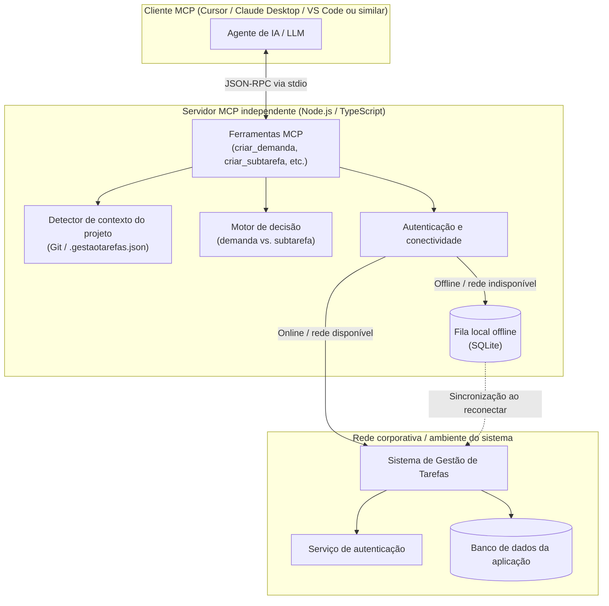

# Arquitetura

Este documento descreve a arquitetura do servidor MCP, seus componentes e o
fluxo de comunicação com o sistema de Gestão de Tarefas. A implementação é
independente do cliente MCP utilizado pelo desenvolvedor.

## Arquitetura geral

## Componentes

### Cliente MCP e agente

O cliente MCP inicia o processo local e mantém a comunicação por stdio. O
agente envia chamadas de ferramentas usando JSON-RPC e recebe os resultados
estruturados pelo servidor.

### Servidor MCP

O servidor é executado como um processo Node.js compilado a partir do
TypeScript. Ele registra as ferramentas disponíveis e coordena a detecção de
contexto, a tomada de decisão, a autenticação e a persistência offline.

### Ferramentas MCP

As ferramentas são a interface operacional do agente. Elas encapsulam as
operações de consulta e alteração de demandas, subtarefas, projetos e sprints.
Antes de executar alterações, verificam o contexto do projeto e as regras de
ativação do MCP.

### Detector de contexto

O detector resolve o projeto corrente em camadas:

1. procura `.gestaotarefas.json` ou `.gestao-tarefas.json` no diretório atual e
   nas pastas pai;
2. consulta os remotos Git e o nome do diretório;
3. compara as informações encontradas com o catálogo de projetos disponível.

O arquivo local também pode indicar que um projeto deve ser ignorado ou que as
operações devem permanecer desativadas.

### Motor de decisão

O motor de decisão apoia a escolha entre criar uma nova demanda e adicionar uma
subtarefa a uma demanda existente. A decisão considera o projeto identificado,
as demandas ativas e os parâmetros informados pela ferramenta.

### Autenticação e conectividade

Esse componente mantém a configuração do servidor de destino, a sessão ou o
token fornecido pelo desenvolvedor e o estado das requisições. As credenciais
permanecem na configuração local e não fazem parte do repositório.

### Fila local offline

Quando a rede corporativa está indisponível, operações compatíveis são gravadas
em uma fila local SQLite. Demandas recebem identificadores temporários, que
permitem vincular subtarefas antes da sincronização.

### Serviço de sincronização

Ao recuperar a conectividade, o serviço envia os itens pendentes na ordem
necessária, substitui identificadores temporários pelos identificadores remotos
e registra falhas individuais sem interromper toda a fila.

## Fluxo de uma operação

1. O agente chama uma ferramenta MCP por stdio.
2. A ferramenta resolve o projeto e verifica se o MCP está ativo para aquele
   contexto.
3. O cliente tenta autenticar e executar a operação no sistema de destino.
4. Se a operação não puder ser enviada por indisponibilidade de rede, ela é
   armazenada na fila local.
5. A sincronização posterior envia as demandas e subtarefas pendentes, resolve
   suas dependências e atualiza os estados locais.

## Limites de responsabilidade

O servidor MCP não substitui as regras de negócio, a autenticação ou o controle
de acesso do sistema de Gestão de Tarefas. O sistema de destino continua sendo
a autoridade para validação, autorização e persistência dos dados.
